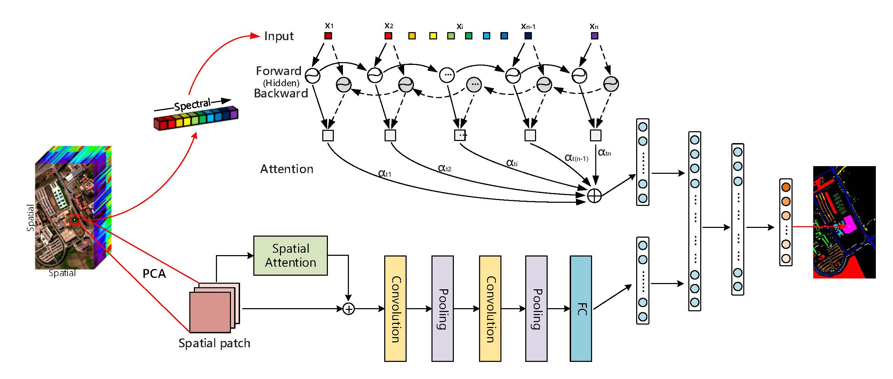

# Spectral-Spatial Attention Network for Hyperspectral Image Classification



## Paper

[Spectral-Spatial Attention Networks for Hyperspectral Image Classification](https://www.mdpi.com/2072-4292/11/8/963)

Please cite our paper if you find it useful for your research.

```
@Article{ssan,
  AUTHOR = {Mei, Xiaoguang and Pan, Erting and Ma, Yong and Dai, Xiaobing and Huang, Jun  and Fan, Fan and Du, Qinglei and Zheng, Hong and Ma, Jiayi},
  TITLE = {Spectral-Spatial Attention Networks for Hyperspectral Image Classification},
  JOURNAL = {Remote Sensing},
  VOLUME = {11},
  YEAR = {2019},
  NUMBER = {8},
  ARTICLE-NUMBER = {963},
  URL = {http://www.mdpi.com/2072-4292/11/8/963},
  ISSN = {2072-4292},
  DOI = {10.3390/rs11080963}
}

```

## Installation

- Install `Tensorflow 1.9.0` with `Python 3.6`.

- Clone this repo

  `git clone https://github.com/EtPan/SSAN`

## Dataset

Download the [Pavia Center dataset](http://www.ehu.eus/ccwintco/uploads/e/e3/Pavia.mat) and its corresponding [ground-truth map](http://www.ehu.eus/ccwintco/uploads/5/53/Pavia_gt.mat).

## Usage

**1. Change the file path**

​	Replace the file path for the hyperspectral data in `save_indices.py` and `indices.py`;Replace the file path for the `ckpt` files of the model in `ssan.py` and `ssan_test.py`.

**2. Split the dataset**

​	Run `save_indices.py` .

**3. Training**

​	Run `ssan.py`.

**4. Testing and Evaluation**

​	Run `ssan_test.py`.
